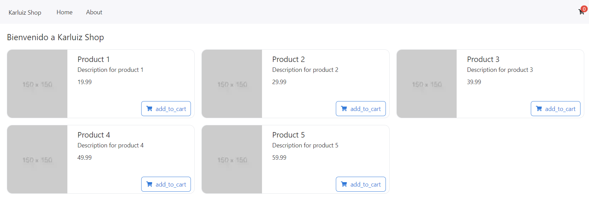

# First Activity

- React with NextJS 

## Objectives

- Create NextJS project using GitHub Copilot from a Scratch.
- Create a Product List Page and Shopping Cart Page.




# Backend Development

**Requirements**

- VS Code version 
- Docker for Desktop
- Node Installed (nvm optional)
- GitHub CLI + GitHub Copilot Extension Enabled 
- Insomnia or Postman or any Rest Client Installed.
- GitHub CLI 


## Step 1: Create a NextJS Project

> @workspace /new create a nextjs 14 and react 18 application with page router with tailwind useHookform and rsuite autprefixer

- Select this folder as your workspace to create the project.
- Install yarn if you haven't installed it yet `npm install -g yarn`
- Install deps using yarn `yarn install`
- Check if the project is running `yarn dev`

## Step 2: Create a Layout Component

> @workspace create a layout with navbar and footer using rsuite

- Install rsuite `yarn add rsuite`
- Create a layout component in the components folder

```tsx
// src/components/Layout.tsx
import React from 'react';
import { Container, Header, Content, Footer, Navbar, Nav } from 'rsuite';

const Layout: React.FC = ({ children }) => {
  return (
    <Container>
      <Header>
        <Navbar>
          <Navbar.Brand href="#">Brand</Navbar.Brand>
          <Nav>
            <Nav.Item href="/">Home</Nav.Item>
            <Nav.Item href="/about">About</Nav.Item>
            <Nav.Item href="/contact">Contact</Nav.Item>
          </Nav>
        </Navbar>
      </Header>
      <Content>
        {children}
      </Content>
      <Footer>
        <p>© 2023 Your Company</p>
      </Footer>
    </Container>
  );
};

export default Layout;
```

- Change the `_app.tsx` file to use the layout component

```tsx
// src/pages/_app.tsx
import React from 'react';
import { AppProps } from 'next/app';
import Layout from '../components/Layout';
import 'rsuite/dist/styles/rsuite-default.css';
import '../styles/globals.css';

const MyApp = ({ Component, pageProps }: AppProps) => {
  return (
    <Layout>
      <Component {...pageProps} />
    </Layout>
  );
};

export default MyApp;
```

### Troubleshooting

#### Tailwind problems

Check if Tailwind is working properly by adding a Tailwind class to the layout component.

> @workspace why tailwind classes inst working

- Suggest install tailwindcss using `yarn add tailwindcss`
- Check tailwind config `tailwind.config.js`

```js	
// tailwind.config.js
module.exports = {
  content: [
    './src/**/*.{js,ts,jsx,tsx}', // Adjust the paths according to your project structure
  ],
  theme: {
    extend: {},
  },
  plugins: [],
};
```
- Import Tailwind CSS in your global styles:
    
```css
/* src/styles/globals.css */
@import './tailwind.css';
```

- Check also `_app.tsx` if the global styles are imported properly.

```tsx
// src/pages/_app.tsx
import { AppProps } from "next/app";
import "rsuite/dist/styles/rsuite-default.css";
import "../styles/globals.css"; // This should import Tailwind CSS
import Layout from "../components/Layout";

function MyApp({ Component, pageProps }: AppProps) {
  return (
    <Layout>
      <Component {...pageProps} />
    </Layout>
  );
}

export default MyApp;
```

- Check if application is running `yarn dev`

#### React Problems

- Check if React is installed properly by checking the `package.json` file.

> Use explain in GH Copilot to see how to solve problems...

```json
{
  "dependencies": {
    "react": "^18.0.0",
    "react-dom": "^18.0.0",
    "next": "^14.0.0",
    "rsuite": "^5.0.0"
  },
  "devDependencies": {
    "@types/react": "^18.0.0",
    "@types/react-dom": "^18.0.0",
    "typescript": "^4.0.0"
  }
}
```

- Is going to suggest remove the `node_modules` folder and install the dependencies again.

```bash
rm -rf node_modules yarn.lock package-lock.json
yarn install
```

- Check if the application is running `yarn dev`

## Step 3: Add i18n Support

> @workspace i want to add support i18n using next-translate to my project

- Install next-translate `yarn add next-translate`
- Update next.config.js: Configure next-translate in your next.config.js file.

```js
const nextTranslate = require('next-translate');

module.exports = nextTranslate({
  // Any other Next.js configuration options here
});
```

- Create i18n configuration file: Create a new file called i18n.js in the root of your project.

```js
// i18n.js
module.exports = {
  locales: ['en', 'es'], // Add your supported languages here
  defaultLocale: 'en',
  pages: {
    '*': ['common'], // Specify namespaces for each page
  },
};
```
- Create locales at root level: Create a folder called locales at the root of your project.

- Create translation files: Inside the locales folder, create a folder for each supported language and add translation files.

```json
// locales/en/common.json
{
  "hello": "Hello, World!",
}
```

```json

// locales/es/common.json
{
  "hello": "¡Hola, Mundo!",
}
```

- Update your index page: Update your index page to use the useTranslation hook from next-translate.

```tsx
// src/pages/index.tsx
import useTranslation from 'next-translate/useTranslation';

const IndexPage: React.FC = () => {
  const { t } = useTranslation('common');
  return (
    <div>
      <span className="text-xl">Welcome</span>
      <p>{t('welcome')}</p>
    </div>
  );
};

export default IndexPage;
```

## Step 4: Adding .env Support

> @workspace i want to add support for .env files in my project

- Install dotenv `yarn add dotenv`
- Create a .env file in the root of your project

```env
# .env
API_MESSAGE="Hello, API from .env!"
```

- Load environment variables in next.config.js: Update your next.config.js to load the environment variables using dotenv.

```js
// next.config.js
require('dotenv').config();

module.exports = {

};
```

- Test the environment variables: Create a new page to test the environment variables.

```tsx
// src/pages/hello.ts

import { NextApiRequest, NextApiResponse } from 'next';

export default function handler(req: NextApiRequest, res: NextApiResponse) {
  res.status(200).json({ message: process.env.API_MESSAGE });
}
```

- Check if the application is running `yarn dev`

## Step 5: Create mocks with Copilot

> create a mock function that return and array with products, every product has and id, name, description, image and price.

```ts
type Product = {
  id: number;
  name: string;
  description: string;
  image: string;
  price: number;
};

function getMockProducts(): Product[] {
  return [
    {
      id: 1,
      name: "Product 1",
      description: "Description for product 1",
      image: "https://via.placeholder.com/150",
      price: 19.99,
    },
    {
      id: 2,
      name: "Product 2",
      description: "Description for product 2",
      image: "https://via.placeholder.com/150",
      price: 29.99,
    },
    {
      id: 3,
      name: "Product 3",
      description: "Description for product 3",
      image: "https://via.placeholder.com/150",
      price: 39.99,
    },
    {
      id: 4,
      name: "Product 4",
      description: "Description for product 4",
      image: "https://via.placeholder.com/150",
      price: 49.99,
    },
    {
      id: 5,
      name: "Product 5",
      description: "Description for product 5",
      image: "https://via.placeholder.com/150",
      price: 59.99,
    },
  ];
}
```

## Step 6: Create a Product Card Component

> create a productcard component based on #file:index.tsx

```tsx
import React from 'react';
import { Product } from './api/hello';

type ProductCardProps = {
  product: Product;
};

const ProductCard: React.FC<ProductCardProps> = ({ product }) => {
  return (
    <div className="flex items-center space-x-4 border p-4 rounded-xl">
      
      <div>
        <h2>{product.name}</h2>
        <p>{product.description}</p>
        <p>{product.price}</p>
      </div>
    </div>
  );
};

export default ProductCard;
```

## Step 7: Add Icons Support

> @workspace i want to add support for icons in my project using react-icons

- Install react-icons `yarn add react-icons`
- Use the icons in your components

```tsx
import React from 'react';
import { Product } from './api/hello';
import { FaShoppingCart } from 'react-icons/fa'; // Import an icon from react-icons

type ProductCardProps = {
  product: Product;
};

const ProductCard: React.FC<ProductCardProps> = ({ product }) => {
  return (
    <div className="flex items-center space-x-4 border p-4 rounded-xl">
      
      <div>
        <h2>{product.name}</h2>
        <p>{product.description}</p>
        <p>{product.price}</p>
        <button className="flex items-center space-x-2 mt-2">
          <FaShoppingCart /> {/* Use the imported icon */}
          <span>Add to Cart</span>
        </button>
      </div>
    </div>
  );
};

export default ProductCard;
```

### Troubleshooting

> how to manage broken images with nextjs

- Check if the image path is correct
- Use the `next/image` component to handle broken images

```tsx
import React, { useState } from "react";
import { FaShoppingCart } from "react-icons/fa";
import { Button } from "rsuite";
import { Product } from "../pages/api/hello";
import Image from "next/image";

type ProductCardProps = {
  product: Product;
};

const ProductCard: React.FC<ProductCardProps> = ({ product }) => {
  const [imgSrc, setImgSrc] = useState(product.image);

  const handleError = () => {
    setImgSrc("/fallback-image.png"); // Path to your fallback image
  };

  return (
    <div className="flex items-center space-x-4 border p-4 rounded-xl">
      <Image
        src={imgSrc}
        alt={product.name}
        width={96}
        height={96}
        className="w-24 h-24"
        onError={handleError}
      />
      <div>
        <h2>{product.name}</h2>
        <p>{product.description}</p>
        <p>{product.price}</p>
        <Button appearance="ghost" className="flex items-center space-x-2 mt-2">
          <FaShoppingCart />
          <span>Add to Cart</span>
        </Button>
      </div>
    </div>
  );
};

export default ProductCard;
```

#### Hostname errors:

> hostname "via.placeholder.com" is not configured under images in your next.config.js file

- Add the hostname to the images property in your next.config.js file.

```js
const nextTranslate = require("next-translate");
require("dotenv").config();

module.exports = nextTranslate({
  images: {
    domains: ["via.placeholder.com"], // Add the external image domain here
  },
  // Any other Next.js configuration options here
});
```

### Make image blur

> how to make blur image meanwhile load resource with next/image

- Use the `placeholder` attribute in the `next/image` component to show a blurred image while the main image is loading.
- Use this base64 image as the value for the `blurDataURL` attribute.

```tsx
blurDataURL="data:image/png;base64,iVBORw0KGgoAAAANSUhEUgAAAAQAAAACCAYAAAB/qH1jAAAACXBIWXMAAAsTAAALEwEAmpwYAAAAJ0lEQVR4nGPY2fXjv458/H9Bbtf/IDbD/7v//8/Mvfq/J+nEfxAbAF3NFsFiuaE1AAAAAElFTkSuQmCC"
```

```tsx
import React, { useState } from "react";
import { FaShoppingCart } from "react-icons/fa";
import { Button } from "rsuite";
import { Product } from "../pages/api/hello";
import Image from "next/image";
import useTranslation from "next-translate/useTranslation";

type ProductCardProps = {
  product: Product;
};

const ProductCard: React.FC<ProductCardProps> = ({ product }) => {
  const { t } = useTranslation("common");
  const [imgSrc, setImgSrc] = useState(product.image);

  const handleError = () => {
    setImgSrc("/images/default-fallback-image.png"); // Path to your fallback image
  };

  return (
    <div className="flex items-center space-x-4 border rounded-xl">
      <div className="w-1/3 h-full">
        <Image
          src={imgSrc}
          alt={product.name}
          width={96}
          height={96}
          className="h-full w-full rounded-t-xl object-cover lg:rounded-l-xl lg:rounded-tr-none"
          onError={handleError}
          placeholder="blur"
          blurDataURL="/images/blur-placeholder.png" // Path to your blur placeholder image
        />
      </div>
      <div className="w-2/3 p-4">
        <h2>{product.name}</h2>
        <p>{product.description}</p>
        <p>{product.price}</p>
        <Button appearance="ghost" className="flex items-center space-x-2 mt-2">
          <FaShoppingCart />
          <span>{t("add_to_cart")}</span>
        </Button>
      </div>
    </div>
  );
};

export default ProductCard;
```

## Step 8: Create Shopping Cart Component + Zustand

> add zustand support to create a shopping card context

- Install zustand `yarn add zustand`
- Create a Zustand store: Create a new file named useCartStore.ts in your src/store directory (or any preferred directory) to define the Zustand store for the shopping cart.

- Update the ProductCard component: Use the Zustand store in the ProductCard component to add products to the cart.

- Create `src/store/useCartStore.ts`

```tsx
import create from 'zustand';

type Product = {
  id: string;
  name: string;
  description: string;
  price: string;
  image: string;
};

type CartState = {
  cart: Product[];
  addToCart: (product: Product) => void;
  removeFromCart: (productId: string) => void;
};

export const useCartStore = create<CartState>((set) => ({
  cart: [],
  addToCart: (product) => set((state) => ({ cart: [...state.cart, product] })),
  removeFromCart: (productId) =>
    set((state) => ({
      cart: state.cart.filter((product) => product.id !== productId),
    })),
}));
```
- Update the ProductCard component to use the Zustand store:

```tsx
import React, { useState } from "react";
import { FaShoppingCart } from "react-icons/fa";
import { Button } from "rsuite";
import { Product } from "../pages/api/hello";
import Image from "next/image";
import useTranslation from "next-translate/useTranslation";
import { useCartStore } from "../store/useCartStore";

type ProductCardProps = {
  product: Product;
};

const ProductCard: React.FC<ProductCardProps> = ({ product }) => {
  const { t } = useTranslation("common");
  const [imgSrc, setImgSrc] = useState(product.image);
  const addToCart = useCartStore((state) => state.addToCart);

  const handleError = () => {
    setImgSrc("/images/default-fallback-image.png"); // Path to your fallback image
  };

  const handleAddToCart = () => {
    addToCart(product);
  };

  return (
    <div className="flex items-center space-x-4 border rounded-xl">
      <div className="w-1/3 h-full">
        <Image
          src={imgSrc}
          alt={product.name}
          width={96}
          height={96}
          className="h-full w-full rounded-t-xl object-cover rounded-l-xl rounded-tr-none"
          onError={handleError}
          placeholder="blur"
          blurDataURL="data:image/png;base64,iVBORw0KGgoAAAANSUhEUgAAAAQAAAACCAYAAAB/qH1jAAAACXBIWXMAAAsTAAALEwEAmpwYAAAAJ0lEQVR4nGPY2fXjv458/H9Bbtf/IDbD/7v//8/Mvfq/J+nEfxAbAF3NFsFiuaE1AAAAAElFTkSuQmCC"
        />
      </div>
      <div className="w-2/3 p-2 relative min-h-40">
        <span className="text-lg">{product.name}</span>
        <p className="line-clamp-2">{product.description}</p>
        <p>{product.price}</p>
        <Button
          appearance="ghost"
          className="flex items-center space-x-2 mt-2 absolute right-2 bottom-1"
          onClick={handleAddToCart}
        >
          <FaShoppingCart />
          <span>{t("add_to_cart")}</span>
        </Button>
      </div>
    </div>
  );
};

export default ProductCard;
```	

### Add a counter Component to show the number of items in the cart

> how to add counter of products on navbar in #file:layout.tsx

- Import the Zustand Store
- Display the Count

```tsx
// src/components/Layout.tsx
import React from "react";
import { Content, Nav, Navbar, Badge } from "rsuite";
import { useCartStore } from "../store/useCartStore";
import { FaShoppingCart } from "react-icons/fa";

const Layout: React.FC<{ children: React.ReactNode }> = ({ children }) => {
  const cartCount = useCartStore((state) => state.cart.length);

  return (
    <div className="h-screen flex flex-col">
      <Navbar>
        <Navbar.Brand href="#">Karluiz Shop</Navbar.Brand>
        <Nav>
          <Nav.Item href="/">Home</Nav.Item>
          <Nav.Item href="/about">About</Nav.Item>
        </Nav>
        <Nav pullRight>
          <Nav.Item href="/cart">
            <Badge content={cartCount}>
              <FaShoppingCart />
            </Badge>
          </Nav.Item>
        </Nav>
      </Navbar>
      <Content className="flex-grow p-4">{children}</Content>
    </div>
  );
};

export default Layout;
```

## Step 9: Create a Cart Page on Drawer

> i want to create a drawer to see the card content using rsuite 

- Import the necessary components from rsuite.
- Create a state to manage the visibility of the drawer.
- Add a Drawer component to the layout.
- Update the cart icon to open the drawer when clicked.
- Display the cart content inside the drawer.

```tsx
// src/components/Layout.tsx
import React, { useState } from "react";
import { FaShoppingCart } from "react-icons/fa";
import { Badge, Content, Nav, Navbar, Drawer, Button } from "rsuite";
import { useCartStore } from "../store/useCartStore";

const Layout: React.FC<{ children: React.ReactNode }> = ({ children }) => {
  const cartCount = useCartStore((state) => state.cart.length);
  const cartItems = useCartStore((state) => state.cart);
  const [drawerOpen, setDrawerOpen] = useState(false);

  const toggleDrawer = () => {
    setDrawerOpen(!drawerOpen);
  };

  return (
    <div className="h-screen flex flex-col">
      <Navbar>
        <Navbar.Brand href="#">Karluiz Shop</Navbar.Brand>
        <Nav>
          <Nav.Item href="/">Home</Nav.Item>
          <Nav.Item href="/about">About</Nav.Item>
        </Nav>
        <Nav pullRight>
          <Nav.Item onClick={toggleDrawer}>
            <Badge content={cartCount}>
              <FaShoppingCart />
            </Badge>
          </Nav.Item>
        </Nav>
      </Navbar>
      <Content className="flex-grow p-4">{children}</Content>

      <Drawer
        size="sm"
        placement="right"
        show={drawerOpen}
        onHide={toggleDrawer}
      >
        <Drawer.Header>
          <Drawer.Title>Cart</Drawer.Title>
        </Drawer.Header>
        <Drawer.Body>
          {cartItems.length > 0 ? (
            <ul>
              {cartItems.map((item, index) => (
                <li key={index}>{item.name} - {item.quantity}</li>
              ))}
            </ul>
          ) : (
            <p>Your cart is empty.</p>
          )}
        </Drawer.Body>
        <Drawer.Footer>
          <Button onClick={toggleDrawer} appearance="primary">
            Close
          </Button>
        </Drawer.Footer>
      </Drawer>
    </div>
  );
};

export default Layout;
```

## Step 10: Create a Cart Page

> Create a card component to show the products added to the cart and also sumarize the total amount of the products added.

```tsx
// src/components/CartCard.tsx
import React from "react";
import { useCartStore } from "../store/useCartStore";
import { Card, List, Button } from "rsuite";

const CartCard: React.FC = () => {
  const cartItems = useCartStore((state) => state.cart);

  const totalAmount = cartItems.reduce((total, item) => {
    return total + item.price * item.quantity;
  }, 0);

  return (
    <Card bordered style={{ width: 300 }}>
      <h4>Shopping Cart</h4>
      {cartItems.length > 0 ? (
        <List bordered>
          {cartItems.map((item, index) => (
            <List.Item key={index} index={index}>
              <div>
                <strong>{item.name}</strong>
                <p>Quantity: {item.quantity}</p>
                <p>Price: ${item.price.toFixed(2)}</p>
                <p>Subtotal: ${(item.price * item.quantity).toFixed(2)}</p>
              </div>
            </List.Item>
          ))}
        </List>
      ) : (
        <p>Your cart is empty.</p>
      )}
      <div className="mt-4">
        <h5>Total Amount: ${totalAmount.toFixed(2)}</h5>
        <Button appearance="primary">Proceed to Checkout</Button>
      </div>
    </Card>
  );
};

export default CartCard;
```

