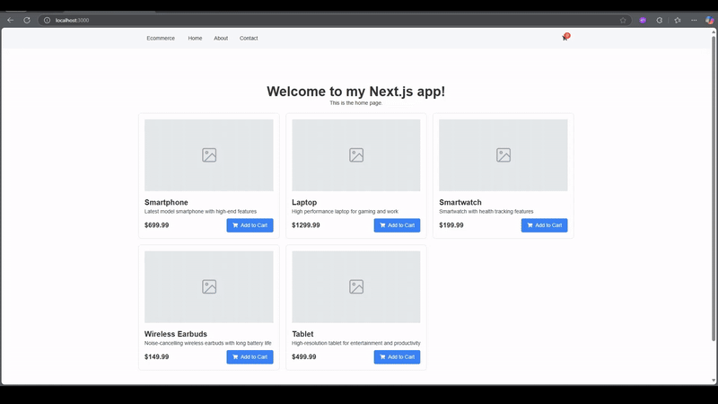

# Segunda Actividad: Crea Tu Carrito de Compras con NextJS

- React con NextJS 

## Objetivos

- Crear un proyecto NextJS usando GitHub Copilot desde cero.
- Crear una Página de Lista de Productos y una Página de Carrito de Compras.




# Desarrollo Backend

**Requisitos**

- Versión de VS Code
- Docker para Desktop
- Node instalado (nvm opcional)
- GitHub CLI + Extensión de GitHub Copilot habilitada
- Insomnia o Postman o cualquier cliente REST instalado.
- GitHub CLI

## Paso 1: Crear un Proyecto NextJS

> @workspace /new crea una aplicación nextjs 14 y react 18 con page router con tailwind useHookform y rsuite autoprefixer

- Selecciona esta carpeta como tu espacio de trabajo para crear el proyecto.
- Instala yarn si aún no lo has instalado `npm install -g yarn`
- Instala las dependencias usando yarn `yarn install`
- Verifica si el proyecto está funcionando `yarn dev`

### Solución de Problemas

- El package.json podría ser diferente porque estamos trabajando con gen-ai, si tienes problemas usa este.

```json
{
  "name": "my-nextjs-app",
  "version": "1.0.0",
  "private": true,
  "scripts": {
    "dev": "next dev",
    "build": "next build",
    "start": "next start"
  },
  "dependencies": {
    "next": "^14.0.0",
    "react": "^18.0.0",
    "react-dom": "^18.0.0",
    "rsuite": "^4.9.0",
    "tailwindcss": "^3.0.0"
  },
  "devDependencies": {
    "@types/node": "22.0.1",
    "@types/react": "^17.0.0",
    "@types/react-dom": "^17.0.0",
    "autoprefixer": "^10.4.0",
    "eslint": "^8.5.0",
    "eslint-config-next": "^12.0.0",
    "postcss": "^8.4.5",
    "postcss-preset-env": "^7.3.1",
    "typescript": "^4.5.4"
  },
  "eslintConfig": {
    "extends": [
      "next",
      "next/core-web-vitals"
    ]
  },
  "browserslist": [
    "defaults"
  ]
}
```

> ⚠️ En caso de tener algún problema con la creación del proyecto, puedes hacer checkout a la rama `step-1` la cual contiene el proyecto base.

```bash
git checkout step-1
```

## Paso 2: Crear un Componente de Layout

> @workspace crea un layout con navbar y footer usando rsuite

- Instala rsuite `yarn add rsuite`
- Crea un componente de layout en la carpeta de componentes

```tsx
// src/components/Layout.tsx
import React from 'react';
import { Container, Header, Content, Footer, Navbar, Nav } from 'rsuite';

const Layout: React.FC = ({ children }) => {
  return (
    <Container>
      <Header>
        <Navbar>
          <Navbar.Brand href="#">Brand</Navbar.Brand>
          <Nav>
            <Nav.Item href="/">Home</Nav.Item>
            <Nav.Item href="/about">About</Nav.Item>
            <Nav.Item href="/contact">Contact</Nav.Item>
          </Nav>
        </Navbar>
      </Header>
      <Content>
        {children}
      </Content>
      <Footer>
        <p>© 2023 Your Company</p>
      </Footer>
    </Container>
  );
};

export default Layout;
```

- Cambia el archivo `_app.tsx` para usar el componente de layout

```tsx
// src/pages/_app.tsx
import React from 'react';
import { AppProps } from 'next/app';
import Layout from '../components/Layout';
import 'rsuite/dist/styles/rsuite-default.css';
import '../styles/globals.css';

const MyApp = ({ Component, pageProps }: AppProps) => {
  return (
    <Layout>
      <Component {...pageProps} />
    </Layout>
  );
};

export default MyApp;
```

### Solución de Problemas

#### Problemas con Tailwind

Verifica si Tailwind está funcionando correctamente añadiendo una clase de Tailwind al componente de layout.

> @workspace por qué las clases de tailwind no están funcionando

- Sugerencia: instala tailwindcss usando `yarn add tailwindcss`
- Verifica la configuración de tailwind `tailwind.config.js`

```js	
// tailwind.config.js
module.exports = {
  content: [
    './src/**/*.{js,ts,jsx,tsx}', // Adjust the paths according to your project structure
  ],
  theme: {
    extend: {},
  },
  plugins: [],
};
```
- Importa Tailwind CSS en tus estilos globales:
    
```css
/* src/styles/globals.css */
@import './tailwind.css';
```

- Revisa también `_app.tsx` para ver si los estilos globales están importados correctamente.

```tsx
// src/pages/_app.tsx
import { AppProps } from "next/app";
import "rsuite/dist/styles/rsuite-default.css";
import "../styles/globals.css"; // This should import Tailwind CSS
import Layout from "../components/Layout";

function MyApp({ Component, pageProps }: AppProps) {
  return (
    <Layout>
      <Component {...pageProps} />
    </Layout>
  );
}

export default MyApp;
```

- Verifica si la aplicación está funcionando `yarn dev`

#### Problemas con React

- Verifica si React está instalado correctamente revisando el archivo `package.json`.

> Usa "explain" en GitHub Copilot para ver cómo resolver problemas...

```json
{
  "dependencies": {
    "react": "^18.0.0",
    "react-dom": "^18.0.0",
    "next": "^14.0.0",
    "rsuite": "^5.0.0"
  },
  "devDependencies": {
    "@types/react": "^18.0.0",
    "@types/react-dom": "^18.0.0",
    "typescript": "^4.0.0"
  }
}
```

- Sugerencia: elimina la carpeta `node_modules` y vuelve a instalar las dependencias.

```bash
rm -rf node_modules yarn.lock package-lock.json
yarn install
```

- Verifica si la aplicación está funcionando `yarn dev`

## Paso 3: Agregar Soporte i18n

> @workspace quiero agregar soporte i18n usando next-translate a mi proyecto

- Instala next-translate `yarn add next-translate`
- Actualiza next.config.js: Configura next-translate en tu archivo next.config.js.

```js
const nextTranslate = require('next-translate');

module.exports = nextTranslate({
  // Any other Next.js configuration options here
});
```

- Crea el archivo de configuración i18n: Crea un nuevo archivo llamado i18n.js en la raíz de tu proyecto.

```js
// i18n.js
module.exports = {
  locales: ['en', 'es'], // Add your supported languages here
  defaultLocale: 'en',
  pages: {
    '*': ['common'], // Specify namespaces for each page
  },
};
```
- Crea locales en el nivel raíz: Crea una carpeta llamada locales en la raíz de tu proyecto.

- Crea archivos de traducción: Dentro de la carpeta locales, crea una carpeta para cada idioma soportado y añade archivos de traducción.

```json
// locales/en/common.json
{
  "hello": "Hello, World!",
}
```

```json

// locales/es/common.json
{
  "hello": "¡Hola, Mundo!",
}
```

- Actualiza tu página de inicio: Actualiza tu página de inicio para usar el hook useTranslation de next-translate.
```tsx

// src/pages/index.tsx
import useTranslation from 'next-translate/useTranslation';

const IndexPage: React.FC = () => {
  const { t } = useTranslation('common');
  return (
    <div>
      <span className="text-xl">Welcome</span>
      <p>{t('welcome')}</p>
    </div>
  );
};

export default IndexPage;
```

### Solución de Problemas

- Si i18n no está funcionando correctamente, baja la versión de la página a 1.6.0

## Paso 4: Agregar Soporte para .env

> @workspace quiero agregar soporte para archivos .env en mi proyecto

- Instala dotenv `yarn add dotenv`
- Crea un archivo .env en la raíz de tu proyecto

```env
# .env
API_MESSAGE="Hello, API from .env!"
```

- Carga variables de entorno en next.config.js: Actualiza tu next.config.js para cargar las variables de entorno usando dotenv.

```js
// next.config.js
require('dotenv').config();

module.exports = {

};
```

- Prueba las variables de entorno: Crea una nueva página para probar las variables de entorno.

```tsx
// src/pages/hello.ts

import { NextApiRequest, NextApiResponse } from 'next';

export default function handler(req: NextApiRequest, res: NextApiResponse) {
  res.status(200).json({ message: process.env.API_MESSAGE });
}
```

- Verifica si la aplicación está funcionando `yarn dev`

> ⚠️ En caso de que no se muestre el mensaje, asegúrate de que el archivo `.env` esté en la raíz del proyecto y reinicia el servidor.

## Paso 5: Crear mocks con Copilot

> crea una función mock que devuelva un array con productos, cada producto tiene un id, nombre, descripción, imagen y precio.

```ts
type Product = {
  id: number;
  name: string;
  description: string;
  image: string;
  price: number;
};

function getMockProducts(): Product[] {
  return [
    {
      id: 1,
      name: "Product 1",
      description: "Description for product 1",
      image: "https://via.placeholder.com/150",
      price: 19.99,
    },
    {
      id: 2,
      name: "Product 2",
      description: "Description for product 2",
      image: "https://via.placeholder.com/150",
      price: 29.99,
    },
    {
      id: 3,
      name: "Product 3",
      description: "Description for product 3",
      image: "https://via.placeholder.com/150",
      price: 39.99,
    },
    {
      id: 4,
      name: "Product 4",
      description: "Description for product 4",
      image: "https://via.placeholder.com/150",
      price: 49.99,
    },
    {
      id: 5,
      name: "Product 5",
      description: "Description for product 5",
      image: "https://via.placeholder.com/150",
      price: 59.99,
    },
  ];
}
```
> Puedes guardar el type `Product en un archivo llamado `Product.ts` en la carpeta `src/utils`.

> Puedes guardar la función `getMockProducts` en un archivo llamado `mocks.ts` en la carpeta `src/utils`.

> En caso de que Copilot no genere el código para mostrar los productos, puedes solicitarle a Copilot que te muestre cómo hacerlo.

```plaintext
  Como puedo mostrar los productos en la página de inicio #file:index.tsx
```

## Paso 6: Crear un Componente de Tarjeta de Producto

> crea un componente de tarjeta de producto basado en #file:index.tsx

```tsx
import React from 'react';
import { Product } from './api/hello';

type ProductCardProps = {
  product: Product;
};

const ProductCard: React.FC<ProductCardProps> = ({ product }) => {
  return (
    <div className="flex items-center space-x-4 border p-4 rounded-xl">
      
      <div>
        <h2>{product.name}</h2>
        <p>{product.description}</p>
        <p>{product.price}</p>
      </div>
    </div>
  );
};

export default ProductCard;
```

> Puedes guardar este componente en un archivo llamado `ProductCard.tsx` en la carpeta `src/components`.

> En caso de que Copilot no genere el código para implementar el componente de tarjeta de producto, puedes solicitarle a Copilot que te muestre cómo hacerlo.

```plaintext
  Cómo puedo usar el componente de tarjeta de producto #file:ProductCard.tsx en la página de inicio #file:index.tsx
``` 

## Paso 7: Agregar Soporte para Iconos

> @workspace quiero agregar soporte para iconos en mi proyecto usando react-icons

- Instala react-icons `yarn add react-icons`
- Usa los iconos en tus componentes

```tsx
import React from 'react';
import { Product } from './api/hello';
import { FaShoppingCart } from 'react-icons/fa'; // Import an icon from react-icons

type ProductCardProps = {
  product: Product;
};

const ProductCard: React.FC<ProductCardProps> = ({ product }) => {
  return (
    <div className="flex items-center space-x-4 border p-4 rounded-xl">
      
      <div>
        <h2>{product.name}</h2>
        <p>{product.description}</p>
        <p>{product.price}</p>
        <button className="flex items-center space-x-2 mt-2">
          <FaShoppingCart /> {/* Use the imported icon */}
          <span>Add to Cart</span>
        </button>
      </div>
    </div>
  );
};

export default ProductCard;
```

> ⚠️ En caso de que Copilot no genere código para mostrar algún icono, puedes solicitarle a Copilot que te muestre cómo hacerlo.

```plaintext
  Cómo puedo mostrar un icono de carrito de compras en el componente de tarjeta de producto #file:ProductCard.tsx
```


### Mostrar Imágen de respaldo en caso de error

Aqui queremos mostrar una imagen de respaldo en caso de que la imagen no se pueda cargar. Para ello, le solicitamos a Copilot que nos muestre cómo hacerlo.

```plaintext
  Cómo puedo mostrar una imagen de respaldo en caso de que la imagen principal no cargue #file:ProductCard.tsx #file:default-fallback-image.png
```
> ℹ️ Debes copiar la imagen llamada `default-fallback-image.png` que se encuentra en la carpeta `assets` de este repositorio y pegarla en la carpeta `public` de tu proyecto.

Aplica los cambios que sugiere Copilot en el componente `ProductCard.tsx` para mostrar la imagen de respaldo en caso de que la imagen principal no cargue.


### Solución de Problemas

> cómo manejar imágenes rotas con nextjs

- Verifica si la ruta de la imagen es correcta
- Usa el componente `next/image` para manejar imágenes rotas

```tsx
import React, { useState } from "react";
import { FaShoppingCart } from "react-icons/fa";
import { Button } from "rsuite";
import { Product } from "../pages/api/hello";
import Image from "next/image";

type ProductCardProps = {
  product: Product;
};

const ProductCard: React.FC<ProductCardProps> = ({ product }) => {
  const [imgSrc, setImgSrc] = useState(product.image);

  const handleError = () => {
    setImgSrc("/fallback-image.png"); // Path to your fallback image
  };

  return (
    <div className="flex items-center space-x-4 border p-4 rounded-xl">
      <Image
        src={imgSrc}
        alt={product.name}
        width={96}
        height={96}
        className="w-24 h-24"
        onError={handleError}
      />
      <div>
        <h2>{product.name}</h2>
        <p>{product.description}</p>
        <p>{product.price}</p>
        <Button appearance="ghost" className="flex items-center space-x-2 mt-2">
          <FaShoppingCart />
          <span>Add to Cart</span>
        </Button>
      </div>
    </div>
  );
};

export default ProductCard;
```

#### Errores de Hostname:

> hostname "via.placeholder.com" no está configurado en la propiedad images de tu archivo next.config.js

- Añade el hostname a la propiedad images en tu archivo next.config.js.

```js
const nextTranslate = require("next-translate");
require("dotenv").config();

module.exports = nextTranslate({
  images: {
    domains: ["via.placeholder.com"], // Add the external image domain here
  },
  // Any other Next.js configuration options here
});
```

### Hacer que la imagen se vea borrosa

> cómo hacer que la imagen se vea borrosa mientras se carga el recurso con next/image

- Usa el atributo `placeholder` en el componente `next/image` para mostrar una imagen borrosa mientras se carga la imagen principal.
- Usa esta imagen base64 como valor para el atributo `blurDataURL`.

```tsx
blurDataURL="data:image/png;base64,iVBORw0KGgoAAAANSUhEUgAAAAQAAAACCAYAAAB/qH1jAAAACXBIWXMAAAsTAAALEwEAmpwYAAAAJ0lEQVR4nGPY2fXjv458/H9Bbtf/IDbD/7v//8/Mvfq/J+nEfxAbAF3NFsFiuaE1AAAAAElFTkSuQmCC"
```

```tsx
import React, { useState } from "react";
import { FaShoppingCart } from "react-icons/fa";
import { Button } from "rsuite";
import { Product } from "../pages/api/hello";
import Image from "next/image";
import useTranslation from "next-translate/useTranslation";

type ProductCardProps = {
  product: Product;
};

const ProductCard: React.FC<ProductCardProps> = ({ product }) => {
  const { t } = useTranslation("common");
  const [imgSrc, setImgSrc] = useState(product.image);

  const handleError = () => {
    setImgSrc("/images/default-fallback-image.png"); // Path to your fallback image
  };

  return (
    <div className="flex items-center space-x-4 border rounded-xl">
      <div className="w-1/3 h-full">
        <Image
          src={imgSrc}
          alt={product.name}
          width={96}
          height={96}
          className="h-full w-full rounded-t-xl object-cover lg:rounded-l-xl lg:rounded-tr-none"
          onError={handleError}
          placeholder="blur"
          blurDataURL="/images/blur-placeholder.png" // Path to your blur placeholder image
        />
      </div>
      <div className="w-2/3 p-4">
        <h2>{product.name}</h2>
        <p>{product.description}</p>
        <p>{product.price}</p>
        <Button appearance="ghost" className="flex items-center space-x-2 mt-2">
          <FaShoppingCart />
          <span>{t("add_to_cart")}</span>
        </Button>
      </div>
    </div>
  );
};

export default ProductCard;
```

## Paso 8: Crear Componente de Carrito de Compras + Zustand

> @workspace agrega soporte de zustand para crear un contexto de carrito de compras

- Instala zustand `yarn add zustand`
- Crea una tienda Zustand: Crea un nuevo archivo llamado useCartStore.ts en tu directorio src/store (o cualquier directorio preferido) para definir la tienda Zustand para el carrito de compras.

- Actualiza el componente ProductCard: Usa la tienda Zustand en el componente ProductCard para agregar productos al carrito.

- Crea `src/store/useCartStore.ts`

```tsx
import {create} from 'zustand';

type Product = {
  id: string;
  name: string;
  description: string;
  price: string;
  image: string;
};

type CartState = {
  cart: Product[];
  addToCart: (product: Product) => void;
  removeFromCart: (productId: string) => void;
};

export const useCartStore = create<CartState>((set) => ({
  cart: [],
  addToCart: (product) => set((state) => ({ cart: [...state.cart, product] })),
  removeFromCart: (productId) =>
    set((state) => ({
      cart: state.cart.filter((product) => product.id !== productId),
    })),
}));
```
> Aqui se puede utilizar el type Product previamente creado. Puedes hacerlo manualmente o pedirle ayuda a Copilot.

Selecciona todo el código del useCartStore y comentale a Copilot que use el type previamnete creado.

```plaintext
  Refactoriza el código para usar el type Product #file:Product.ts #selection
```

- Actualiza el componente ProductCard para usar la tienda Zustand:

```tsx
import React, { useState } from "react";
import { FaShoppingCart } from "react-icons/fa";
import { Button } from "rsuite";
import { Product } from "../pages/api/hello";
import Image from "next/image";
import useTranslation from "next-translate/useTranslation";
import { useCartStore } from "../store/useCartStore";

type ProductCardProps = {
  product: Product;
};

const ProductCard: React.FC<ProductCardProps> = ({ product }) => {
  const { t } = useTranslation("common");
  const [imgSrc, setImgSrc] = useState(product.image);
  const addToCart = useCartStore((state) => state.addToCart);

  const handleError = () => {
    setImgSrc("/images/default-fallback-image.png"); // Path to your fallback image
  };

  const handleAddToCart = () => {
    addToCart(product);
  };

  return (
    <div className="flex items-center space-x-4 border rounded-xl">
      <div className="w-1/3 h-full">
        <Image
          src={imgSrc}
          alt={product.name}
          width={96}
          height={96}
          className="h-full w-full rounded-t-xl object-cover rounded-l-xl rounded-tr-none"
          onError={handleError}
          placeholder="blur"
          blurDataURL="data:image/png;base64,iVBORw0KGgoAAAANSUhEUgAAAAQAAAACCAYAAAB/qH1jAAAACXBIWXMAAAsTAAALEwEAmpwYAAAAJ0lEQVR4nGPY2fXjv458/H9Bbtf/IDbD/7v//8/Mvfq/J+nEfxAbAF3NFsFiuaE1AAAAAElFTkSuQmCC"
        />
      </div>
      <div className="w-2/3 p-2 relative min-h-40">
        <span className="text-lg">{product.name}</span>
        <p className="line-clamp-2">{product.description}</p>
        <p>{product.price}</p>
        <Button
          appearance="ghost"
          className="flex items-center space-x-2 mt-2 absolute right-2 bottom-1"
          onClick={handleAddToCart}
        >
          <FaShoppingCart />
          <span>{t("add_to_cart")}</span>
        </Button>
      </div>
    </div>
  );
};

export default ProductCard;
```

### Solución de Problemas

#### Problemas con la importación de Zustand
En caso de que tengas problemas con la importación de Zustand, asegúrate de que estes importantando el create de la siguiente manera:

```ts
import { create } from 'zustand';
```

### Add a counter Component to show the number of items in the cart

> cómo agregar un contador de productos en la barra de navegación en #file:layout.tsx

- Importa la tienda Zustand
- Muestra el contador

```tsx
// src/components/Layout.tsx
import React from "react";
import { Content, Nav, Navbar, Badge } from "rsuite";
import { useCartStore } from "../store/useCartStore";
import { FaShoppingCart } from "react-icons/fa";

const Layout: React.FC<{ children: React.ReactNode }> = ({ children }) => {
  const cartCount = useCartStore((state) => state.cart.length);

  return (
    <div className="h-screen flex flex-col">
      <Navbar>
        <Navbar.Brand href="#">Karluiz Shop</Navbar.Brand>
        <Nav>
          <Nav.Item href="/">Home</Nav.Item>
          <Nav.Item href="/about">About</Nav.Item>
        </Nav>
        <Nav pullRight>
          <Nav.Item href="/cart">
            <Badge content={cartCount}>
              <FaShoppingCart />
            </Badge>
          </Nav.Item>
        </Nav>
      </Navbar>
      <Content className="flex-grow p-4">{children}</Content>
    </div>
  );
};

export default Layout;
```

## Paso 9: Crear una Página de Carrito en un Drawer

> @workspace quiero crear un drawer para ver el contenido del carrito usando rsuite

- Importa los componentes necesarios de rsuite.
- Crea un estado para gestionar la visibilidad del drawer.
- Añade un componente Drawer al layout.
- Actualiza el icono del carrito para abrir el drawer cuando se haga clic.
- Muestra el contenido del carrito dentro del drawer.

```tsx
// src/components/Layout.tsx
import React, { useState } from "react";
import { FaShoppingCart } from "react-icons/fa";
import { Badge, Content, Nav, Navbar, Drawer, Button } from "rsuite";
import { useCartStore } from "../store/useCartStore";

const Layout: React.FC<{ children: React.ReactNode }> = ({ children }) => {
  const cartCount = useCartStore((state) => state.cart.length);
  const cartItems = useCartStore((state) => state.cart);
  const [drawerOpen, setDrawerOpen] = useState(false);

  const toggleDrawer = () => {
    setDrawerOpen(!drawerOpen);
  };

  return (
    <div className="h-screen flex flex-col">
      <Navbar>
        <Navbar.Brand href="#">Karluiz Shop</Navbar.Brand>
        <Nav>
          <Nav.Item href="/">Home</Nav.Item>
          <Nav.Item href="/about">About</Nav.Item>
        </Nav>
        <Nav pullRight>
          <Nav.Item onClick={toggleDrawer}>
            <Badge content={cartCount}>
              <FaShoppingCart />
            </Badge>
          </Nav.Item>
        </Nav>
      </Navbar>
      <Content className="flex-grow p-4">{children}</Content>

      <Drawer
        size="sm"
        placement="right"
        show={drawerOpen}
        onHide={toggleDrawer}
      >
        <Drawer.Header>
          <Drawer.Title>Cart</Drawer.Title>
        </Drawer.Header>
        <Drawer.Body>
          {cartItems.length > 0 ? (
            <ul>
              {cartItems.map((item, index) => (
                <li key={index}>{item.name} - {item.quantity}</li>
              ))}
            </ul>
          ) : (
            <p>Your cart is empty.</p>
          )}
        </Drawer.Body>
        <Drawer.Footer>
          <Button onClick={toggleDrawer} appearance="primary">
            Close
          </Button>
        </Drawer.Footer>
      </Drawer>
    </div>
  );
};

export default Layout;
```

## Paso 10: Crear una Página de Carrito

> Crea un componente de tarjeta para mostrar los productos añadidos al carrito y también resume el monto total de los productos añadidos.

```tsx
// src/components/CartCard.tsx
import React from "react";
import { useCartStore } from "../store/useCartStore";
import { Card, List, Button } from "rsuite";

const CartCard: React.FC = () => {
  const cartItems = useCartStore((state) => state.cart);

  const totalAmount = cartItems.reduce((total, item) => {
    return total + item.price * item.quantity;
  }, 0);

  return (
    <Card bordered style={{ width: 300 }}>
      <h4>Shopping Cart</h4>
      {cartItems.length > 0 ? (
        <List bordered>
          {cartItems.map((item, index) => (
            <List.Item key={index} index={index}>
              <div>
                <strong>{item.name}</strong>
                <p>Quantity: {item.quantity}</p>
                <p>Price: ${item.price.toFixed(2)}</p>
                <p>Subtotal: ${(item.price * item.quantity).toFixed(2)}</p>
              </div>
            </List.Item>
          ))}
        </List>
      ) : (
        <p>Your cart is empty.</p>
      )}
      <div className="mt-4">
        <h5>Total Amount: ${totalAmount.toFixed(2)}</h5>
        <Button appearance="primary">Proceed to Checkout</Button>
      </div>
    </Card>
  );
};

export default CartCard;
```

Una vez que hayas creado el componente `CartCard`, puedes añadirlo al drawer en el componente `Layout` o pedirle ayuda a Copilot para hacerlo.

## Paso 11: Gestionar la Cantidad de Productos y el Estado Global

> crea un método en #file:useCartStore.ts que devuelva la cantidad del carrito basada en los artículos y totalQuantity.

```ts
// src/store/useCartStore.ts
import { create } from "zustand";
import { Product as OriginalProduct } from "./pages/api/products";

type Product = OriginalProduct & { quantity: number };

type CartState = {
  cart: Product[];
  addToCart: (product: OriginalProduct) => void;
  removeFromCart: (productId: string) => void;
  getCartQuantity: () => number;
};

export const useCartStore = create<CartState>((set, get) => ({
  cart: [],
  addToCart: (product) =>
    set((state) => {
      const existingProduct = state.cart.find((p) => p.id === product.id);
      if (existingProduct) {
        return {
          cart: state.cart.map((p) =>
            p.id === product.id ? { ...p, quantity: p.quantity + 1 } : p
          ),
        };
      } else {
        return { cart: [...state.cart, { ...product, quantity: 1 }] };
      }
    }),
  removeFromCart: (productId) =>
    set((state) => {
      const existingProduct = state.cart.find((p) => p.id === productId);
      if (existingProduct && existingProduct.quantity > 1) {
        return {
          cart: state.cart.map((p) =>
            p.id === productId ? { ...p, quantity: p.quantity - 1 } : p
          ),
        };
      } else {
        return {
          cart: state.cart.filter((product) => product.id !== productId),
        };
      }
    }),
  getCartQuantity: () => {
    const state = get();
    return state.cart.reduce((total, product) => total + product.quantity, 0);
  },
}));

```

- Ahora reemplaza la lógica en `layout.tsx` para usar el nuevo método.

```tsx
const cartCount = useCartStore((state) => state.getCartQuantity());
```
## Paso 12: Usar hookForm para realizar una compra (opcional)

> quiero usar hookform para realizar un evento de compra en mi página del carrito #file:Cart.tsx y api/purchase.ts 

- Primero crea una función de compra en /api/purchase.ts

```ts
// src/pages/api/purchase.ts
import { NextApiRequest, NextApiResponse } from "next";

export default function handler(req: NextApiRequest, res: NextApiResponse) {
  if (req.method === "POST") {
    // Process the purchase
    res.status(200).json({ message: "Purchase successful!" });
  } else {
    res.status(405).json({ message: "Method not allowed" });
  }
}
```

- Ahora crea un hookForm para realizar la compra en `layout.tsx`

## Paso 13: Agregar sonido a los botones del carrito (opcional)

> quiero agregar un efecto de sonido cuando el usuario añade un producto al carrito usando el hook useSound